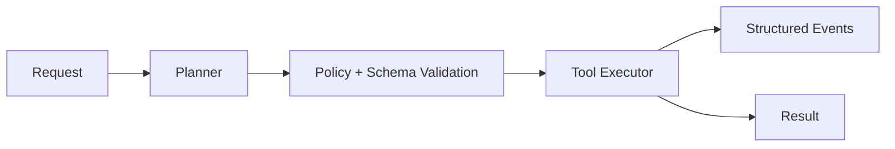

# Agent Foundry

Typed, policy-controlled, observable execution for tool-using agents.

Agent Foundry is intentionally small: it demonstrates the dangerous boundary between model intent and real-world side effects without hiding it behind a framework. The local runtime uses a deterministic planner so the safety and execution path can be tested without an API key.

## Architecture



The production seam is explicit:

- `contracts.py` defines bounded request, tool-call, state, and result schemas.
- `policy.py` allowlists tools and rejects malformed calls.
- `runtime.py` owns the state machine and event trail.
- `tools.py` contains typed side-effect handlers.
- `api.py` exposes a small FastAPI surface.

## Quickstart

```bash
python3 -m venv .venv
source .venv/bin/activate
pip install -e '.[test]'
pytest
uvicorn agent_foundry.api:app --app-dir src --reload
```

In another terminal:

```bash
curl -X POST http://localhost:8000/runs \
  -H 'content-type: application/json' \
  -d '{"task":"Follow up with Acme","dry_run":true}'
```

## Trade-offs and boundaries

- The default planner is deterministic, making tests reproducible and avoiding an API key for local development.
- `dry_run` is the safe default; non-dry execution only uses an allowlisted fake CRM action.
- Events are returned in the response for now. A production deployment should persist them and add correlation IDs to an external trace system.
- There is no unbounded queue or automatic retry yet; those are deliberate next increments, not hidden behavior.

## Evaluation

The first acceptance criteria are behavioral:

- unknown tools are rejected;
- malformed tool arguments fail explicitly;
- dry runs never execute side effects;
- each result includes a state trail;
- local tests run without model credentials.

Next iterations will add durable idempotency keys, approval gates, bounded retries, and p50/p95 execution benchmarks.
