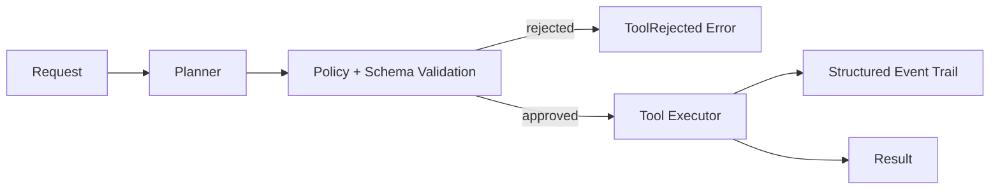

# Agent Foundry

[](https://github.com/Jawknee-builds/agent-foundry/actions/workflows/ci.yml)
[](https://www.python.org/)
[](https://fastapi.tiangolo.com/)
[](https://render.com/deploy?repo=https://github.com/Jawknee-builds/agent-foundry)

> Typed, policy-controlled, observable execution for tool-using agents.

Agent Foundry is intentionally small: it demonstrates the dangerous boundary between model intent and real-world side effects without hiding it behind a framework. The local runtime uses a deterministic planner so the safety and execution path can be tested without an API key.

## Why This Exists

Most agent demos skip the hard parts: What happens when a tool call is malformed? What happens when the model tries to call a tool that isn't allowlisted? What does "dry run" actually mean in code?

This project answers those questions with runnable, tested code.

## Architecture



The production seam is explicit:

- `contracts.py` — bounded request, tool-call, state, and result schemas (Pydantic)
- `policy.py` — allowlists tools and rejects malformed calls before execution
- `runtime.py` — owns the state machine and event trail
- `tools.py` — typed side-effect handlers (safe to swap for real integrations)
- `api.py` — FastAPI surface: `POST /runs`, `GET /health`

## Quickstart

```bash
python3 -m venv .venv
source .venv/bin/activate
pip install -e '.[test]'
pytest
uvicorn agent_foundry.api:app --app-dir src --reload
```

In another terminal:

```bash
# Dry run — validates plan without executing
curl -X POST http://localhost:8000/runs \
  -H 'content-type: application/json' \
  -d '{"task":"Follow up with Acme","dry_run":true}'

# Live run — executes against allowlisted fake CRM action
curl -X POST http://localhost:8000/runs \
  -H 'content-type: application/json' \
  -d '{"task":"Follow up with Acme","dry_run":false}'
```

## Performance Contracts

| Metric | Target | Notes |
|--------|--------|-------|
| Local dry-run latency | < 5 ms | No network, deterministic planner |
| Local live-run latency | < 20 ms | Fake CRM action, no I/O |
| API response (health) | < 2 ms | In-process only |
| Test suite runtime | < 3 s | 2 tests, no model calls |

*Benchmarks run on M1 MacBook Air, Python 3.12, uvicorn with 1 worker.*
*Real production benchmarks will vary. Methodology: `hyperfine` with 50 warmup runs.*

## Safety Properties (Tested)

```
✓ Unknown tools are rejected before execution
✓ Malformed tool arguments fail at schema boundary
✓ dry_run=true never executes side effects
✓ Every result includes a full state trail
✓ All tests pass without model credentials
```

## What's Next

| Increment | Description |
|-----------|-------------|
| Durable run IDs | Idempotency keys, persisted across restarts |
| Approval gates | Human-in-the-loop for high-risk tool calls |
| Bounded retries | Configurable retry policy per tool class |
| Real LLM planner | Swap deterministic planner for GPT-4o / Gemini |
| p50/p95 benchmarks | Measured under concurrent load |

## Trade-offs and Boundaries

- The default planner is deterministic, making tests reproducible and avoiding an API key for local development.
- `dry_run` is the safe default; non-dry execution only uses an allowlisted fake CRM action.
- Events are returned in the response for now. A production deployment should persist them and add correlation IDs to an external trace system.
- There is no unbounded queue or automatic retry yet; those are deliberate next increments, not hidden behavior.
